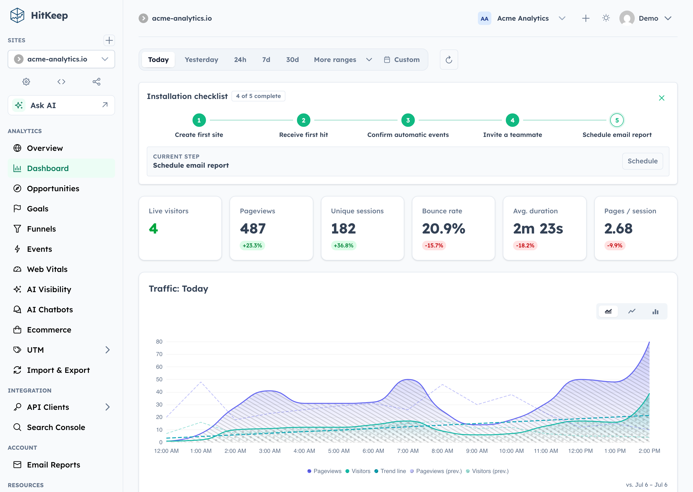
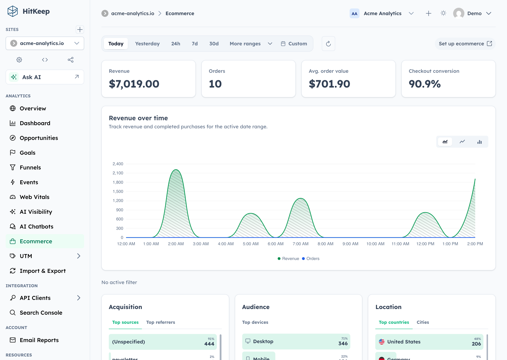
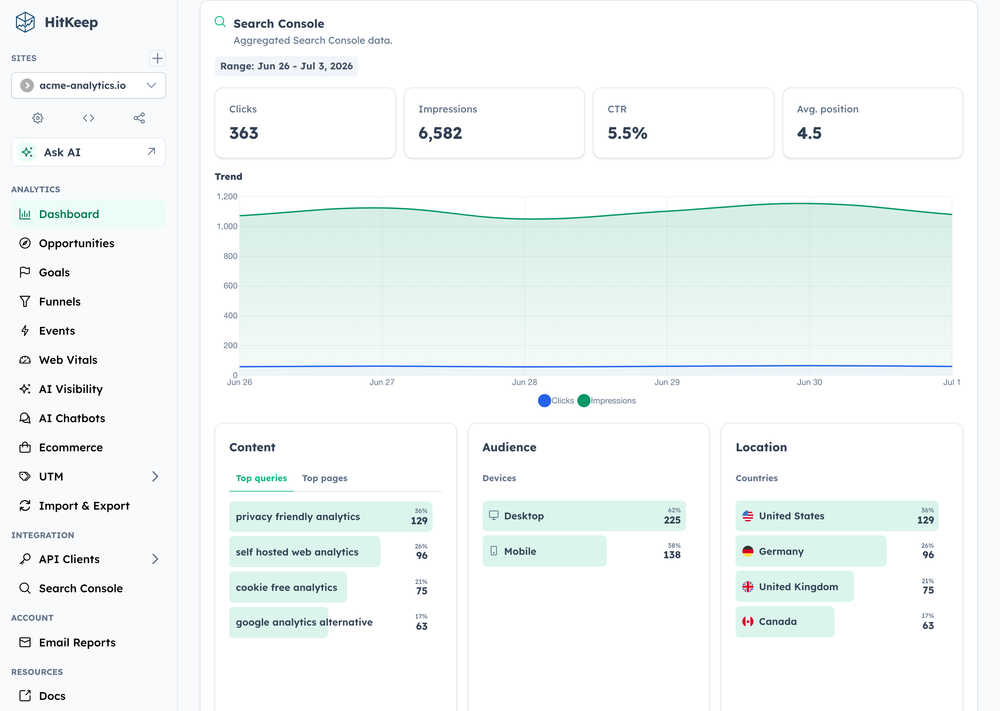
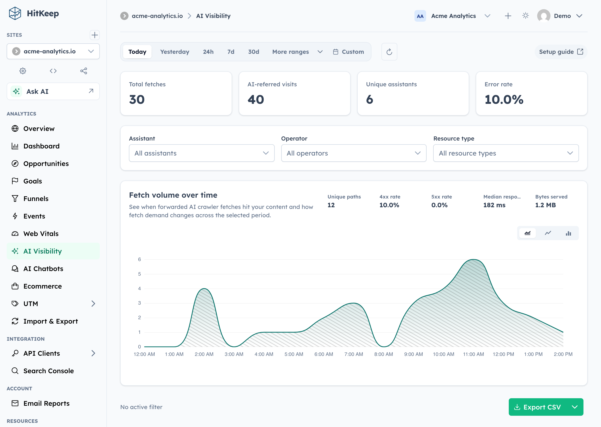
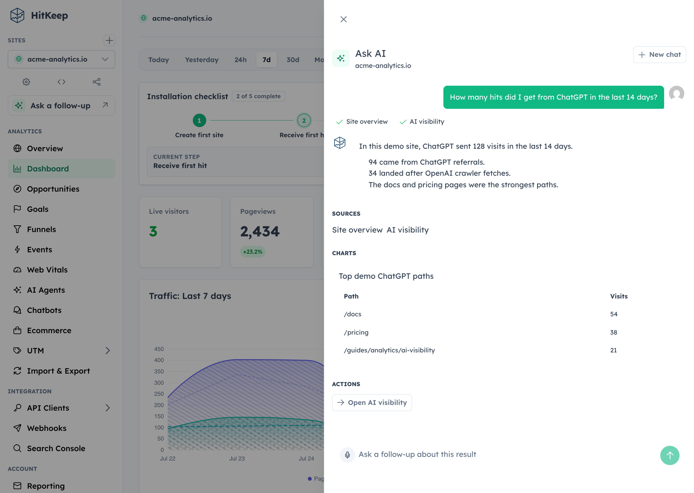
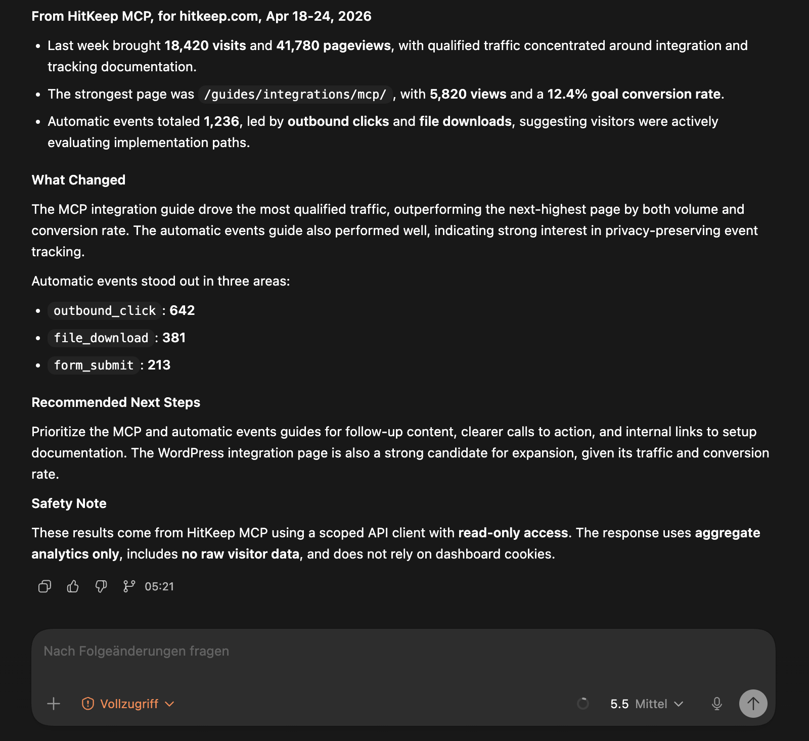

# HitKeep

> Privacy-first web analytics with conversion reporting, AI visibility, and optional Ask AI, self-hosted or in EU/US cloud.

[](https://github.com/PascaleBeier/hitkeep/actions/workflows/ci.yml)
[](https://github.com/PascaleBeier/hitkeep/releases)
[](./LICENSE)
[](https://github.com/PascaleBeier/hitkeep/blob/main/go.mod)
[](https://github.com/PascaleBeier/hitkeep/blob/main/frontend/dashboard/package.json)
[](https://hub.docker.com/r/pascalebeier/hitkeep)
[](https://hitkeep.com/guides/introduction/)
[](https://www.bestpractices.dev/projects/11990)
[](https://glama.ai/mcp/servers/PascaleBeier/hitkeep)

HitKeep is open source web analytics for teams that want useful product reporting, conversion analytics, and AI-era search visibility without running PostgreSQL, Redis, ClickHouse, or a separate queue. It ships as a single Go binary with an embedded Angular dashboard, DuckDB storage, and in-process NSQ queueing.

[Website](https://hitkeep.com) · [Live Demo](https://demo.hitkeep.com/share/7a55968bb42df256512fbe7ff73ab88f29dd45c236eddc818bd66420b4ffbaad) · [Docs](https://hitkeep.com/guides/introduction/) · [Cloud](https://hitkeep.com/cloud) · [AI Performance](https://hitkeep.com/ai-performance/) · [API](https://hitkeep.com/api/) · [Releases](https://github.com/PascaleBeier/hitkeep/releases)



## Why HitKeep

- **Low-ops self-hosting:** one binary, one data directory, embedded DuckDB and NSQ — no external services to run
- **Useful reports:** multi-site Overview, top pages, landing and exit pages, events, goals, funnels, ecommerce, UTM attribution, QR campaigns, Web Vitals, email reports, and Google Search Console aggregates
- **Privacy defaults:** cookie-less tracking, Do Not Track support, and focused data collection
- **AI visibility:** server-side crawler fetch analytics, AI-referred visits, on-site chatbot outcomes, and correlation reports
- **Ask AI:** optional dashboard assistant that answers site-scoped aggregate questions with citations, small charts, and safe dashboard actions
- **Team controls:** passkeys, TOTP, site and team permissions, share links, audit logs, scoped API clients, and a read-only MCP analytics server
- **Deployment choice:** run it yourself or use managed cloud in the EU or US

## Quick Start

### Docker

Save this as `compose.yml`:

```yaml
services:
  hitkeep:
    image: pascalebeier/hitkeep:latest
    restart: unless-stopped
    ports:
      - "8080:8080"
    volumes:
      - hitkeep_data:/var/lib/hitkeep/data
    environment:
      # any flag can also be set as an environment variable
      HITKEEP_JWT_SECRET: replace-this-with-a-long-random-string
    command:
      - "-public-url=http://localhost:8080"

volumes:
  hitkeep_data: {}
```

Then start it:

```bash
docker compose up -d
```

Open `http://localhost:8080` and create your first account. More compose examples — including Caddy, nginx, and Traefik setups — live in [`examples/`](./examples/).

### Binary

Download the latest release for your platform (`hitkeep-linux-amd64` or `hitkeep-linux-arm64`) and run it:

```bash
curl -LO https://github.com/PascaleBeier/hitkeep/releases/latest/download/hitkeep-linux-amd64
chmod +x hitkeep-linux-amd64
export HITKEEP_JWT_SECRET="$(openssl rand -hex 32)" # keep this stable across restarts
./hitkeep-linux-amd64 -public-url="http://localhost:8080"
```

Open `http://localhost:8080` and create your first account.

### Going to production

For reverse proxies, SMTP, systemd, Kubernetes, S3 archiving, and every configuration flag, use the docs instead of this README:

- [Installation guides](https://hitkeep.com/guides/installation/)
- [Configuration reference](https://hitkeep.com/reference/configuration/)
- [Cloud documentation](https://hitkeep.com/cloud)

## Track Your Site

Create a site in the dashboard, then add the tracker to your pages:

```html
<script async src="https://your-hitkeep-instance.com/hk.js"></script>
```

Send a custom event:

```html
<script>
  window.hk = window.hk || {};
  window.hk.event?.("signup", { plan: "pro", source: "landing-page" });
</script>
```

Teams can also serve the tracker from their own verified domains, for example `https://analytics.example.com/hk.js`, via **Team Settings → Tracking domains**. DNS verification, TLS options, and ready-made Caddy, nginx, Traefik, and Helm configurations are covered in the [custom tracking domains guide](https://hitkeep.com/guides/tracking/custom-tracking-domains/) and [`examples/`](./examples/).

More tracking guides:

- [Tracking docs](https://hitkeep.com/guides/tracking/)
- [Custom events](https://hitkeep.com/guides/tracking/custom-events/)
- [Ecommerce analytics](https://hitkeep.com/guides/analytics/ecommerce/)
- [AI visibility analytics](https://hitkeep.com/guides/analytics/ai-visibility/)
- [CloudFront AI crawler tracking](https://hitkeep.com/guides/tracking/cloudfront-ai-crawler-tracking/)
- [WordPress integration](https://hitkeep.com/guides/integrations/wordpress/)

## Product Tour

<details>
<summary>See six product screenshots</summary>

### Dashboard


### Ecommerce


### Search Console


### AI Visibility


### Ask AI


### MCP Access


</details>

## Documentation

The maintained reference lives on `hitkeep.com`.

- [Getting started](https://hitkeep.com/guides/introduction/)
- [Installation](https://hitkeep.com/guides/installation/)
- [Configuration](https://hitkeep.com/reference/configuration/)
- [REST API reference](https://hitkeep.com/api/)
- [Ask AI analytics assistant](https://hitkeep.com/guides/analytics/ask-ai/)
- [Google Search Console integration](https://hitkeep.com/guides/integrations/google-search-console/)
- [AI chatbot analytics](https://hitkeep.com/guides/analytics/ai-chatbot-analytics/)
- [Read-only MCP server for web analytics](https://hitkeep.com/use-cases/read-only-mcp-server-web-analytics/)
- [Compliance](https://hitkeep.com/compliance/overview/)
- [Comparison pages](https://hitkeep.com/vs/)
- [Agent Skills](./skills/)

## Cloud

If you want the same product without running it yourself, start here:

- [Start in the EU](https://cloud.hitkeep.eu/signup)
- [Start in the US](https://cloud.hitkeep.com/signup)
- [Cloud overview](https://hitkeep.com/cloud)

## Development

The fastest way to a working contributor setup is Docker — one command starts the Go backend, Angular dashboard, Mailpit, and seeded demo data:

```bash
make dev-docker-seed
```

Open `http://localhost:4200` and sign in with `demo@example.com` / `demo1234`.

Use `make dev-docker-cloud-seed` for the same hot-reload stack with the local
cloud/billing build tags and safe cloud defaults. `make help` lists the
maintained entry points, and `make doctor` checks your local prerequisites.

For native builds you need Go 1.26+, Node.js 24+, Make, and a working C toolchain for DuckDB:

```bash
git clone https://github.com/pascalebeier/hitkeep.git
cd hitkeep
make build
./hitkeep
```

For day-to-day native development with live reload on `http://localhost:4200`:

```bash
make dev       # Go backend + Angular dashboard
make dev-seed  # the same, plus seeded demo data
```

Contributor docs and local development guides:

- [Contributing guide](./CONTRIBUTING.md)
- [Dashboard development notes](./frontend/dashboard/README.md)
- [Changelog](./CHANGELOG.md)

## License

Distributed under the MIT License. See [LICENSE](./LICENSE).
